# 🚀 Transforme Tudo

> **Ecossistema Mobile de Alta Performance para Gestão de Treinamento Biomecânico, Produtividade e Desenvolvimento Pessoal**

O **Transforme Tudo** não é apenas um aplicativo de treinos; é um motor determinístico de engenharia de software aplicado à biomecânica. Desenvolvido em Flutter e sustentado por uma topologia Firebase (NoSQL) otimizada para leitura ($O(1)$), o sistema elimina o "achismo" da musculação. 

Através do nosso Motor Cascata 2.0 e do Sistema de Auditoria de Carga (SAC 6.5), o app calcula a real transferência de tensão mecânica, cruza sinergias musculares indiretas e entrega periodizações exatas, protegidas por uma interface fluida, *dark theme* premium e integrações nativas com o sistema operacional (Overlays flutuantes e Background Tasks).

---

## 🌐 Acesse o Protótipo

Teste a fluidez da interface via Web (PWA), baixe a build nativa para Android ou entenda a engenharia por trás do projeto no nosso vídeo de arquitetura:

* 🖥️ **Acesso Web (PWA):** [Clique aqui para acessar a demonstração](https://transformetudo.web.app)
* 📱 **Download Android (APK):** [Baixar TransformeTudo.apk](https://github.com/gabriel-tupynamba/transforme_tudo-doc/releases/download/v1.0.0/Transforme_Tudo.apk).
* 🎬 **Vídeo de Arquitetura & Deep Dive:** *Em breve*

### 🗝️ Acesso Demonstrativo (Modo Auditoria)
Para testes operacionais rápidos, utilize as credenciais de homologação:
* **Usuário:** `ContaTeste`
* **Senha:** `testando`

---

## 🧠 Core de Engenharia & Diferenciais Arquiteturais

O verdadeiro poder do Transforme Tudo roda nos bastidores. A arquitetura foi desenhada para suportar cálculos matriciais complexos sem onerar a bateria ou a memória do dispositivo:

1. **Motor Cascata 2.0 & Sinergia Indireta (WEP):** Em vez de IA generativa (que sofre com alucinações), utilizamos um algoritmo matemático determinístico. O motor calcula o impacto cruzado entre grupamentos (ex: a carga indireta que um Supino gera no Tríceps), converte os coeficientes fracionários através de iterações de reequilíbrio e entrega ao usuário séries inteiras e exatas.
2. **Função de Poda Lógica (Pruning):** O sistema protege o Sistema Nervoso Central (SNC) do usuário avaliando o Volume Total. Se o volume indireto de exercícios compostos atingir a meta de grupamentos secundários (como Glúteos, Antebraços ou Oblíquos), o algoritmo realiza uma "poda", removendo isoladores redundantes dinamicamente da interface para prevenir *overtraining*.
3. **Caching em Memória (RAM) & Read-Optimized NoSQL:** Para garantir que o gerador de treinos rode na velocidade da luz, o banco de dados do Firebase armazena os coeficientes pré-calculados. Ao iniciar o app, o `ExerciseRepository` carrega o ecossistema biomecânico em um cache Singleton na memória. As validações cruzadas ocorrem localmente no dispositivo em $O(1)$, anulando latência de rede.
4. **Integração OS Profunda (A "Forja" / Bubble Overlays):** A execução do treino não fica presa à tela do app. Utilizando Foreground Services nativos do Android e `flutter_overlay_window`, o cronômetro de descanso e o controle de séries sobrepõem outros apps (como Spotify ou WhatsApp) em uma "Bolha Flutuante", garantindo gestão de tempo sem fricção.
5. **"Corte de Espada" (Parsing Inteligente de Strings):** Para lidar com mais de 300 variações de exercícios, desenvolvemos um algoritmo de parsing via delimitadores (`|` e `()`). Isso permite ao backend aplicar matrizes de coeficientes únicos (ex: `SUPINO RETO | MÁQUINA ARTICULADA` tendo peso diferente de `BARRA`), enquanto o frontend renderiza nomes limpos e agrupados no Histórico e Hall da Fama.

---

## 🎨 UI/UX & Design System ("Templo do Corpo")

A interface foi tratada com rigor de produto Premium, unindo usabilidade com estímulo psicológico:

* **Dark Theme Dinâmico:** Paleta focada em SolidSurface escuro com contrastes pontuais em Ouro (`_kGold`), utilizando *Glassmorphism* (fundos translúcidos) para profundidade.
* **Onboarding com Mock Data (Empty States Educativos):** Telas vazias geram frustração. Nossos painéis de Evolução de Carga e Pódio de Recordes Pessoais injetam dados fictícios realistas e imponentes se o usuário for novo, criando uma vitrine que atua como gatilho psicológico para o registro de treinos.
* **Animações Fluidas:** Transições geridas por `AnimatedSize` e `Slivers`. A interface reage organicamente: se o usuário seleciona 6 dias de treino, o sistema dinamicamente expande a tela oferecendo configurações biomecânicas avançadas.

---

## 📱 Galeria e Fluxo de Telas

  
  
  
  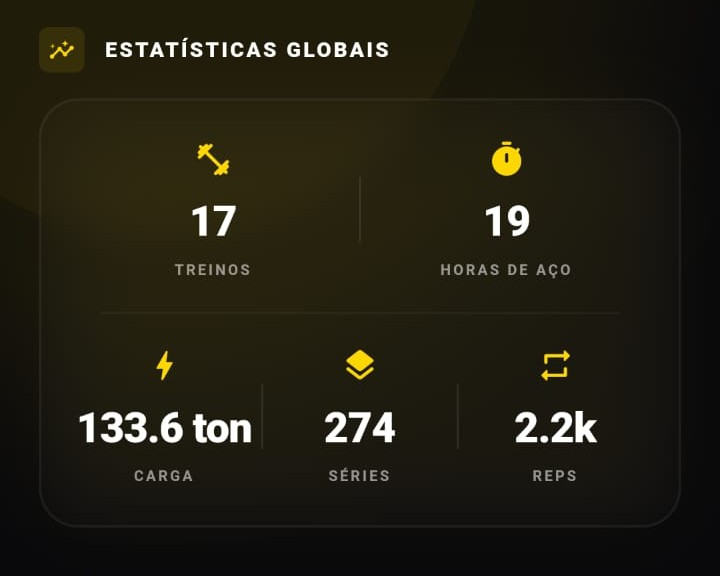

 

  
<b>1. Autenticação e Navegação Principal</b> (Clique para expandir)

   
  <i>Fluxo de entrada do usuário e visualização das abas principais do aplicativo.</i>
    
  <table align="center">
    <tr>
      <td></td>
      <td></td>
      <td></td>
    </tr>
    <tr>
      <td></td>
      <td></td>
      <td>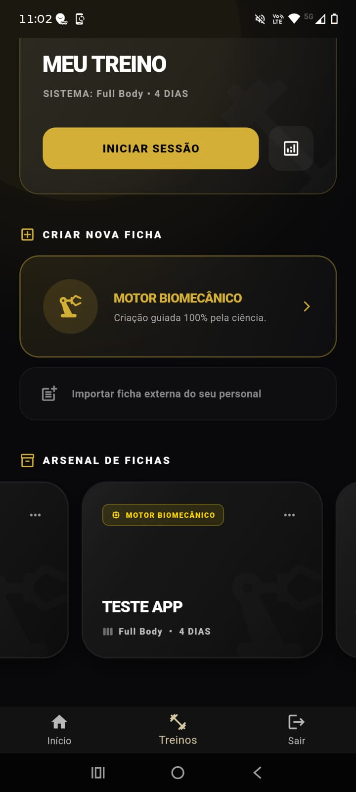</td>
    </tr>
  </table>

  
<b>2. Criação de Fichas (Montador e Ficha Externa)</b> (Clique para expandir)

   
  <i>Motor inteligente para estruturação de treinos e adição de fichas predefinidas.</i>
    
  <b>Montador Dinâmico:</b>
  <table align="center">
    <tr>
      <td></td>
      <td></td>
      <td></td>
    </tr>
    <tr>
      <td></td>
      <td></td>
      <td></td>
    </tr>
    <tr>
      <td>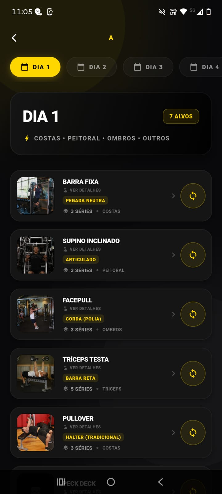</td>
      <td></td>
      <td></td>
    </tr>
    <tr>
      <td>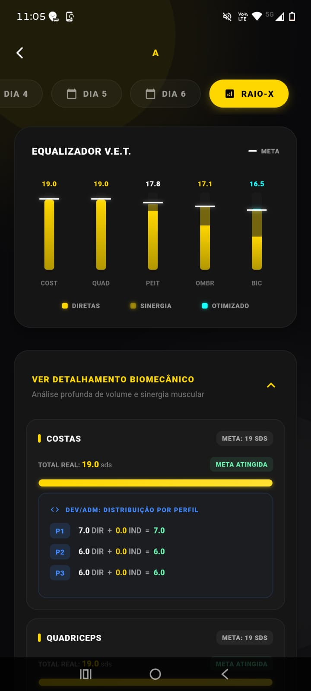</td>
      <td></td>
      <td></td>
    </tr>
  </table>
   
  <b>Ficha Externa:</b>
  <table align="center">
    <tr>
      <td></td>
      <td></td>
      <td></td>
    </tr>
  </table>

  
<b>3. Arsenal de Fichas</b> (Clique para expandir)

   
  <i>Gestão das fichas já estruturadas e salvas pelo usuário.</i>
    
  <table align="center">
    <tr>
      <td>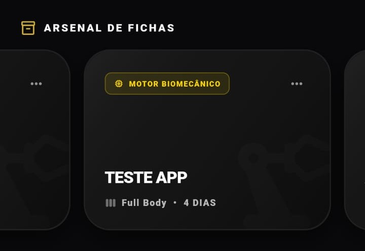</td>
      <td></td>
    </tr>
  </table>

  
<b>4. Execução: Treino Ativo</b> (Clique para expandir)

   
  <i>Acompanhamento em tempo real durante o treino, incluindo descansos e anotações.</i>
    
  <table align="center">
    <tr>
      <td></td>
      <td></td>
      <td></td>
    </tr>
    <tr>
      <td>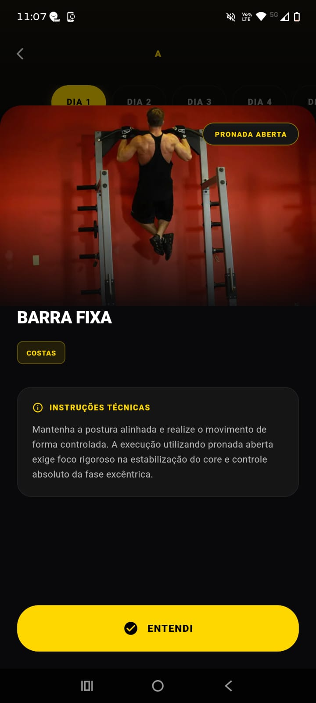</td>
      <td></td>
      <td></td>
    </tr>
    <tr>
      <td></td>
      <td></td>
      <td></td>
    </tr>
  </table>

  
<b>5. Histórico, Estatísticas e Evolução</b> (Clique para expandir)

   
  <i>Acompanhamento de progresso, calendário de treinos executados e quebra de recordes (PRs).</i>
    
  <b>Estatísticas Globais e Calendário:</b>
  <table align="center">
    <tr>
      <td></td>
      <td></td>
      <td></td>
    </tr>
    <tr>
      <td></td>
      <td>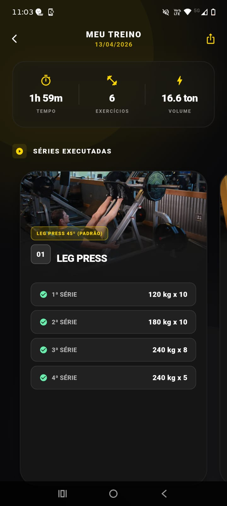</td>
      <td></td>
    </tr>
  </table>
   
  <b>Evolução Contínua e Hall da Fama (PRs):</b>
  <table align="center">
    <tr>
      <td>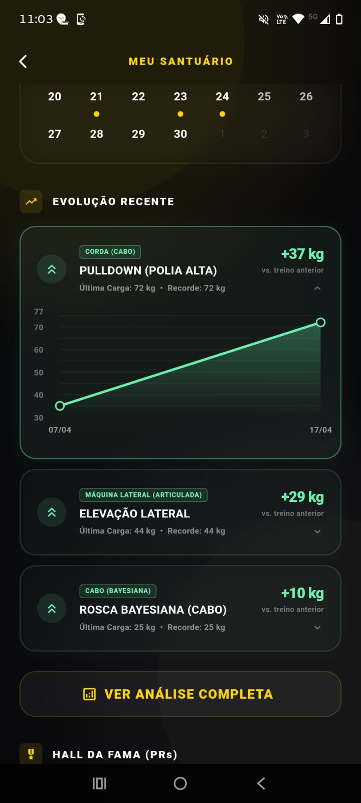</td>
      <td>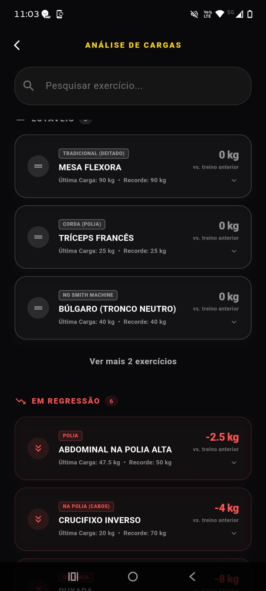</td>
      <td>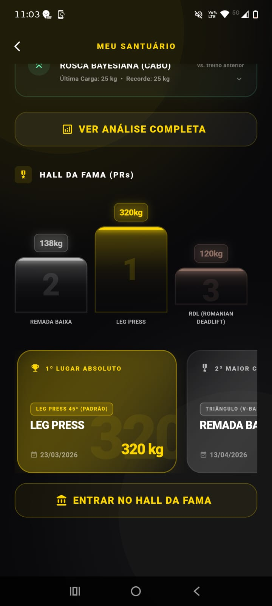</td>
    </tr>
    <tr>
      <td>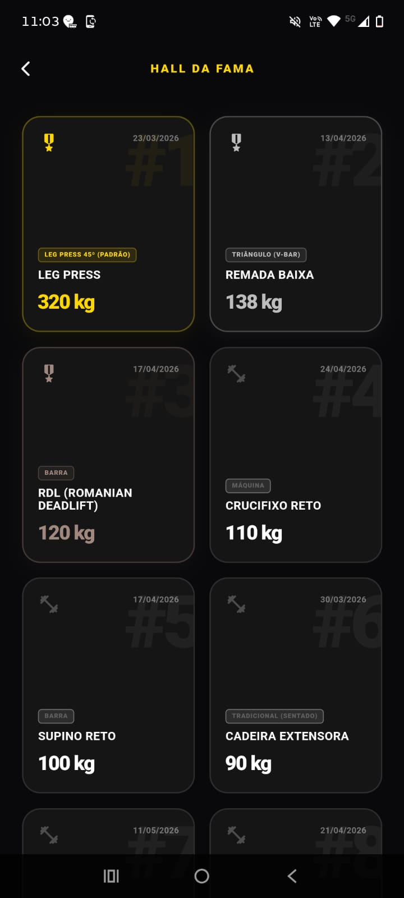</td>
      <td></td>
      <td></td>
    </tr>
  </table>

---

## 📚 Documentação Técnica (Deep Dive)

Para desenvolvedores e engenheiros de dados interessados nas engrenagens do projeto, detalhamos nossa documentação nos módulos internos da pasta `/docs`:

* 🗄️ **[Arquitetura e Modelagem NoSQL](docs/arquitetura_e_banco_de_dados.md):** A topologia relacional simulada e o desacoplamento de UI/Dados.
* ⚙️ **[Motor Biomecânico SAC 6.5](docs/motor_biomecanico_sac_6_5.md):** Os critérios binários de estabilidade vetorial e cálculo do índice de Equivalência de Série ($S_e$).
* 🧬 **[Algoritmo de Prescrição - Cascata 2.0](docs/algoritmo_de_prescricao_wep.md):** Equalizador V.E.T., distribuição de matrizes e funções de teto/piso (*Ceiling/Floor*).
* 🛡️ **[UX, Regras de Negócio e Auto-Tester](docs/regras_de_negocio_e_fluxos.md):** A máquina de estados da UI e a Sala de Auditoria Biomecânica restrita para desenvolvedores testarem baterias de treinos em massa.

---

## 🛠️ Stack Tecnológica & Ecossistema Flutter

* **Core, Auth & Backend:** `firebase_core`, `firebase_auth`, `cloud_firestore` (NoSQL).
* **Integrações de SO (Background):** `flutter_foreground_task`, `flutter_overlay_window`, `wakelock_plus`.
* **Motor Multimídia:** `youtube_player_flutter`, `just_audio`, `cached_network_image`, `flutter_cache_manager`.
* **Data Vizualization & Gestão:** `fl_chart` (Renderização gráfica avançada), `table_calendar`.
* **Infra & Utilitários:** `shared_preferences`, `path_provider`, `flutter_dotenv`, `intl`.

---

  Desenvolvido com rigor acadêmico, arquitetura modular avançada e excelência em engenharia de software.

