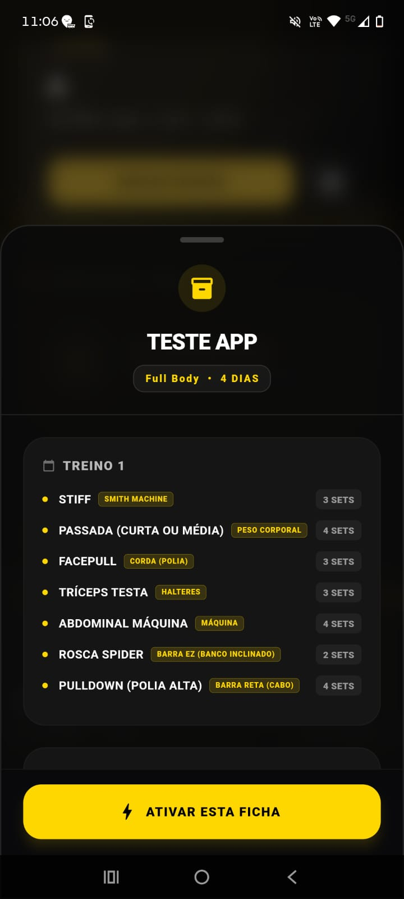

# 🎒 Arsenal de Fichas

Central de gestão onde todas as rotinas e fichas estruturadas pelo usuário ficam salvas para uso rápido e ativação. 

Aqui, o usuário tem acesso imediato a todo o seu ecossistema de treinos já auditados e prontos para execução.

 

### Minhas Fichas (Visão Geral)
Interface de seleção rápida das fichas guardadas.

  

---

[⬅️ Voltar para a Página Inicial](../README.md)