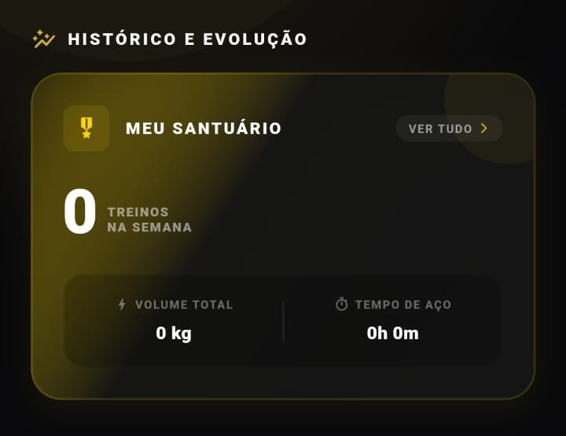
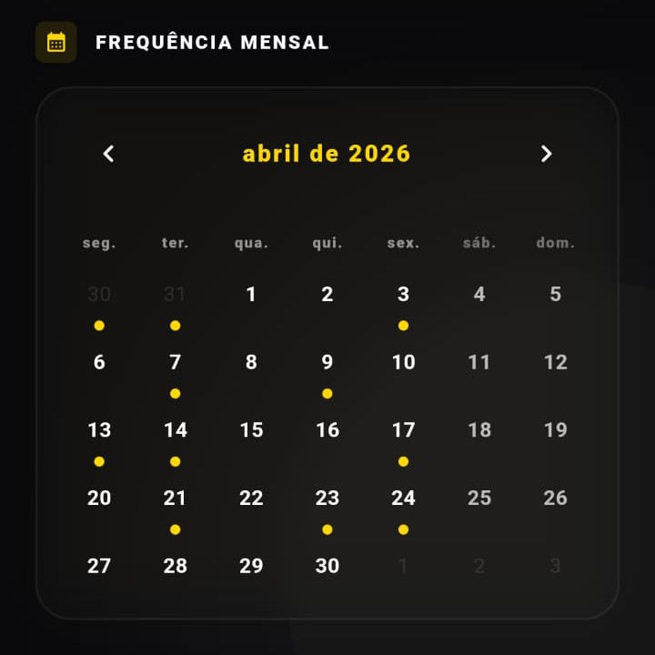
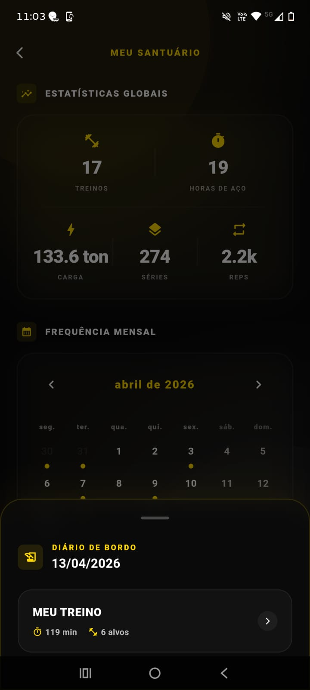

# 📈 Histórico, Estatísticas e Evolução

A central de inteligência de dados do aplicativo. Aqui o usuário visualiza o seu progresso consolidado, o calendário de consistência e os recordes pessoais batidos ao longo da sua jornada de treinos.

 

### 1. Estatísticas Globais
Visão panorâmica do volume levantado, frequência semanal e tempo sob tensão.

  

### 2. Calendário de Treinos
Mapeamento diário de consistência. O usuário pode clicar nos dias de treino para acessar o raio-x detalhado de sessões anteriores.

  
  
  

### 3. Evolução Contínua
Gráficos e métricas de acompanhamento da variação de carga e volume ao longo do tempo.

  
  

### 4. Hall da Fama (PRs - Personal Records)
Pódio automático destacando os maiores recordes absolutos e relativos do usuário, gerando gamificação e estímulo.

  
  

---

[⬅️ Voltar para a Página Inicial](../README.md)