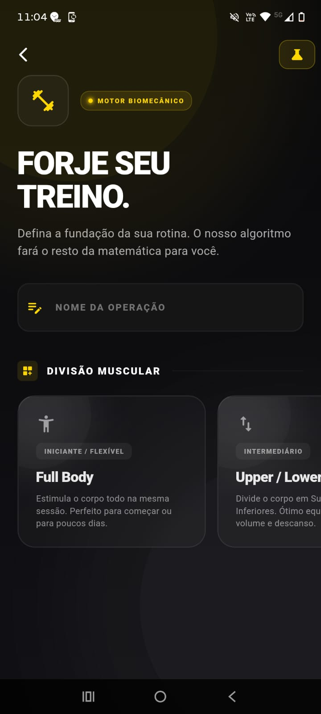
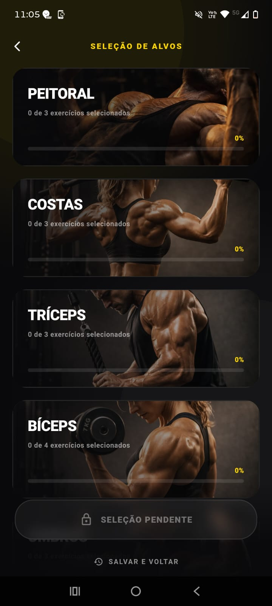
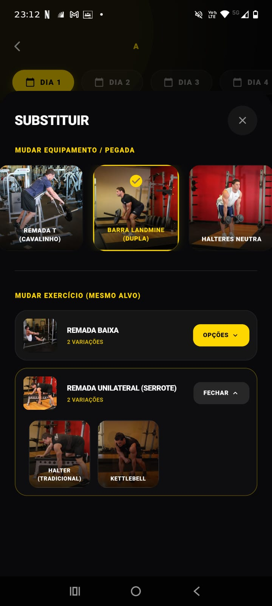
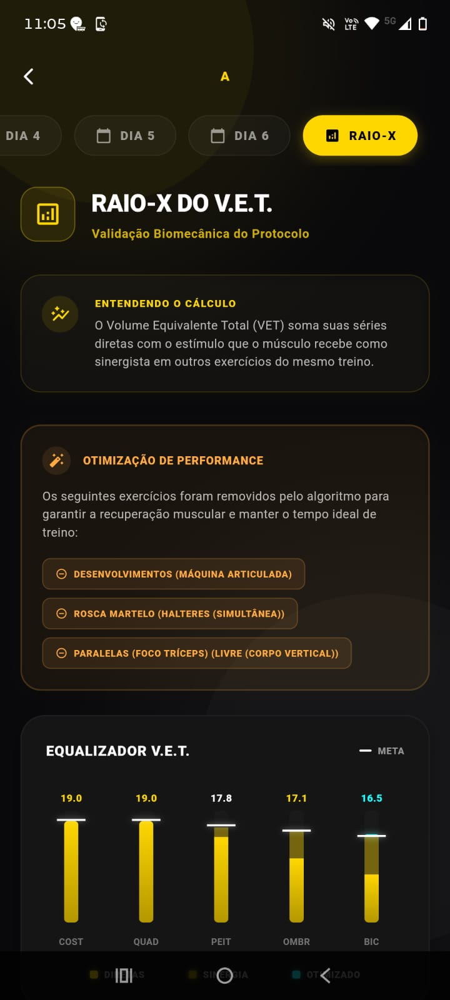
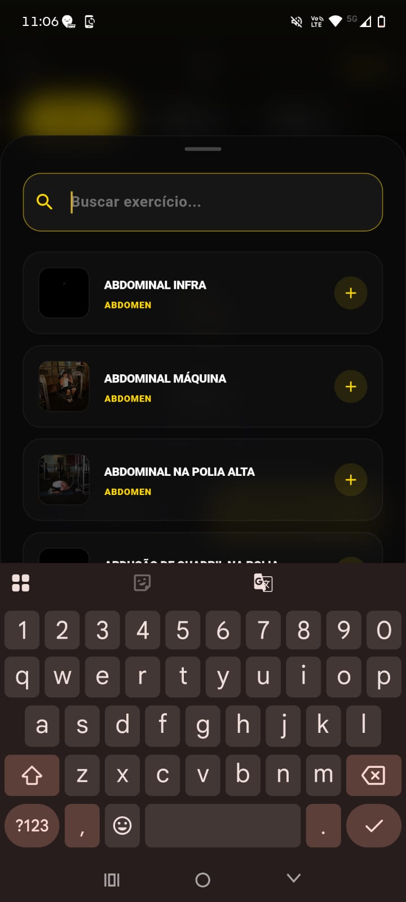

# ⚙️ Criação de Fichas (Montador Dinâmico e Fichas Externas)

O motor inteligente para estruturação de treinos é o coração do aplicativo. Ele permite a criação guiada através do nosso Motor Cascata 2.0 ou a adição de rotinas predefinidas com validação biomecânica instantânea. 

Abaixo, detalhamos o fluxo completo de montagem de um treino pelo usuário, dividido por etapas de navegação:

 

### 1. Configurações Iniciais (Start Screen)
A tela de partida do motor. Definição da divisão muscular, frequência semanal e ajustes primários do algoritmo antes de gerar a estrutura base do treino.

  
  

### 2. Seleção e Perfis de Exercícios (Selection Screens)
Ao clicar nos grupamentos musculares, o usuário é direcionado para a tela de perfis de movimento, onde pode refinar os exercícios sugeridos pelo sistema ou escolher variações específicas.

  
  
  

### 3. Sumário e Auditoria Biomecânica (Summary Screen)
A tela final de aprovação do treino. Aqui o usuário visualiza o escopo geral da ficha estruturada, pode realizar trocas dinâmicas baseadas em equivalência e analisa o mapa de calor de recrutamento através do Raio-X.

  
  
  
  

### 4. Ficha Externa (Rotinas Predefinidas)
Fluxo alternativo para a inserção rápida de rotinas externas, pesquisa direta de exercícios no banco de dados e configuração ágil dos dias da semana.

  
  
  

---

[⬅️ Voltar para a Página Inicial](../README.md)