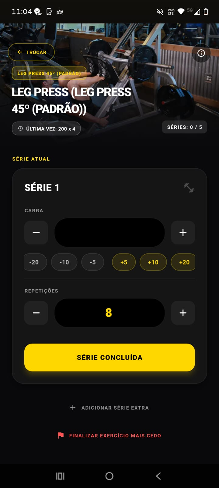

# 🏋️ Execução: Treino Ativo

Módulo responsável pelo acompanhamento em tempo real durante a execução do treino no salão da academia, otimizado para gestão de foco e produtividade.

O fluxo de execução foi desenhado para exigir o mínimo de interação com a tela, permitindo que o usuário foque no exercício.

 

### 1. Preparação e Visão Geral
Antes de iniciar o cronômetro, o usuário visualiza o escopo da ficha ativa e pode checar os detalhes biomecânicos da sessão.

  
  

### 2. Execução, Controle e Descanso
Durante o treino, a interface foca na progressão das séries. O usuário pode registrar anotações (RPE, dores) e o cronômetro de descanso assume o controle do tempo.

  
  
  

### 3. Resumo e Conclusão do Treino
Ao finalizar a sessão, o sistema consolida as estatísticas do treino, apresentando o volume total movimentado, tempo de duração e impacto muscular.

  

---

[⬅️ Voltar para a Página Inicial](../README.md)